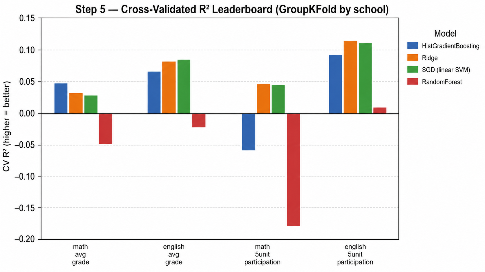

# 📊 Predicting Israeli High School Bagrut Success Using Socioeconomic Data

> An end-to-end, empirical data-science pipeline analysing the **structural
> relationship between municipal socioeconomics and secondary-school
> matriculation (Bagrut) outcomes in Israel** — from raw Hebrew government data
> to cross-validated, explainable machine-learning models.


**Authors:** Yousef Shihade & Shada Essawi · *Data Science Lab — Final Project*

---

## 🎯 Research Questions

1. **Main:** Can a municipality's socioeconomic status *alone* predict a high
   school's average performance and advanced-track selection?
2. **Secondary:** Which academic subjects are most **resilient** to socioeconomic
   disparity, and are there low-SES schools that consistently match elite results?

We model four school-level targets: **average Bagrut grade** and **5-unit
(advanced-track) participation rate**, each for **Mathematics** and **English**.

---

## 🏗 Pipeline Architecture

The project is organised as **five isolated, self-contained, sequential stages**.
Each folder owns its own `README.md`, `config.yaml`, `code/`, data, and graphs,
and consumes the previous stage's output.

```
            datasets/  (raw CBS .xlsx + Bagrut .csv — git-ignored)
                 │
                 ▼
┌─────────────────────────────────────────────────────────────────────┐
│ STEP 1 · Ingestion & Hebrew Text Standardization                    │
│   utf-8-sig BOM, CBS header offsets, whitespace/yod normalization     │
└─────────────────────────────────────────────────────────────────────┘
                 │   bagrut_clean.csv · ses_clean.csv
                 ▼
┌─────────────────────────────────────────────────────────────────────┐
│ STEP 2 · Multi-Stage Data Merging & Integration                      │
│   exact → structural → crosswalk → fuzzy   →  99.44% match, no leak   │
└─────────────────────────────────────────────────────────────────────┘
                 │   merged_bagrut_ses.csv
                 ▼
┌─────────────────────────────────────────────────────────────────────┐
│ STEP 3 · Feature Engineering & Target Setup                          │
│   re-grain to school × year · takers-weighted grades · 5-unit rates   │
└─────────────────────────────────────────────────────────────────────┘
                 │   school_level_features_targets.csv
                 ▼
┌─────────────────────────────────────────────────────────────────────┐
│ STEP 4 · Preprocessing, Outliers & MICE Imputation Experiment        │
│   MICE vs median · Isolation Forest + LOF · 2 exploratory questions   │
└─────────────────────────────────────────────────────────────────────┘
                 │   cleaned_modeling_ready.csv
                 ▼
┌─────────────────────────────────────────────────────────────────────┐
│ STEP 5 · ML Tournament & Explainability                              │
│   GroupKFold(semel) · VIF · Boruta · Ridge/SGD/RF/HGB · SHAP          │
└─────────────────────────────────────────────────────────────────────┘
```

### Repository layout

```
BagrutProject/
├── README.md  ·  LICENSE  ·  requirements.txt
├── datasets/                                  # raw inputs (git-ignored)
├── step_1_ingestion_standardization/
├── step_2_data_merging_integration/
├── step_3_feature_engineering_target_setup/
├── step_4_preprocessing_outliers_imputation_experiment/
└── step_5_predictive_modeling_explainability/
```

---

## 🧪 Key Experimental Footprints

**MICE imputation experiment (Step 4).** Following the rubric, we masked 8 % of a
fully-populated feature (the CBS socioeconomic index) and reconstructed it with
**MICE** (`IterativeImputer`) versus a median baseline:

| Method | RMSE | MAE | **R²** |
|---|--:|--:|--:|
| **MICE (IterativeImputer)** | **0.209** | **0.143** | **0.949** |
| Median baseline | 0.928 | 0.782 | −0.003 |

➡️ **MICE cuts reconstruction error by ~77 %** (R² **0.949** vs ~0), because it
exploits the structure between features while the median ignores it.

**Other footprints:** 99.44 % Hebrew locality match rate (Step 2) · Isolation
Forest + LOF outlier consensus (Step 4) · 87/460 (18.9 %) low-SES "overachiever"
schools identified (Step 4).

---

## 🏆 Modeling Leaderboard

Final **cross-validated** performance (5-fold **`GroupKFold` grouped by school**
so a school's multiple years never leak across folds). Champion = **tuned
HistGradientBoosting**, which won every target.

| 🎯 Target | Type | **R²** | RMSE | MAE |
|---|---|--:|--:|--:|
| `english_5unit_participation` | participation | **0.192** | 0.245 | 0.194 |
| `english_avg_grade` | grade | **0.150** | 5.986 | 4.535 |
| `math_avg_grade` | grade | 0.094 | 7.188 | 5.600 |
| `math_5unit_participation` | participation | 0.056 | 0.101 | 0.080 |

> 🥇 **HistGradientBoosting** (tuned via `RandomizedSearchCV`) beat Ridge, the
> SGD linear-SVM, and RandomForest across all four targets. Deep RandomForest
> overfit (negative R²); the SES→outcome surface is smooth, so regularised models win.

---

## 📈 Core Analytical Deliverables

**MICE vs Median imputation health** — MICE tracks the true density; the median
collapses onto a spike.


**Subject resilience gap (cluster 2 → 9)** — Math's gap is smaller on both grade
and advanced participation: Math is the more resilient subject.


**Low-SES overachievers** — 18.9 % of poor-locality schools match elite grades,
and they funnel ~2.6–2.7× more pupils into advanced Math & English tracks.


**Cross-validated model leaderboard** — R² by model across the four targets.



---

## 🎓 Executive Scientific Takeaway

Across three independent methods — **Step-4 cluster-gap analysis**, **Boruta
feature confirmation**, and **SHAP attribution** — the same asymmetry emerges:

> **Municipal socioeconomic status holds moderate predictive variance over
> *English* advanced-track selection (R² ≈ 0.19) and English grades (R² ≈ 0.15),
> but its signal is heavily bounded for *Mathematics* advanced tracking
> (R² ≈ 0.06).** Boruta even *confirms* the socioeconomic `cluster` as a predictor
> for the English targets yet drops it for Math — independent corroboration that
> the **Math advanced pipeline is markedly more resilient** to socioeconomic
> disparity across the Israeli education landscape.

In short: **SES predicts *who selects English* far better than *who selects
Math*, and selection better than raw grades** — and that resilience of the Math
pipeline is the project's central, reproducible finding.

---

## ⚙️ Reproducing the Pipeline

```bash
# 1. Environment (Anaconda Python 3.11 recommended)
pip install -r requirements.txt

# 2. Place the two raw files in datasets/ (see data sources below)

# 3. Run each stage in order (each is CWD-independent and self-verifying)
python step_1_ingestion_standardization/code/run_step1.py
python step_2_data_merging_integration/code/run_step2.py
python step_3_feature_engineering_target_setup/code/run_step3.py
python step_4_preprocessing_outliers_imputation_experiment/code/run_step4.py
python step_5_predictive_modeling_explainability/code/run_step5.py
```

### 📦 Data sources (raw files are git-ignored, not redistributed)

- **Dataset 1 — Bagrut Grades 2013–2016** (Israeli Freedom of Information Law),
  Kaggle: <https://www.kaggle.com/datasets/emachlev/bagrut-israel/data>
- **Dataset 2 — CBS Socioeconomic Index**: Israel Central Bureau of Statistics,
  <https://www.cbs.gov.il/>

---

## 🔬 Mandated Methods Coverage

| Category | Method | Stage |
|---|---|---|
| Imputation | **MICE** (IterativeImputer) | Step 4 |
| Outlier detection | **Isolation Forest**, **Local Outlier Factor** | Step 4 |
| Modeling | **SGD** (linear SVM), Ridge, RandomForest, **HistGradientBoosting** | Step 5 |
| Feature selection | **Boruta** | Step 5 |
| Explainability | **SHAP** | Step 5 |
| Collinearity | **VIF** | Step 5 |

---

## 🧰 Tech Stack

`Python 3.11` · `pandas` · `numpy` · `scikit-learn` · `statsmodels` · `shap` ·
`Boruta` · `rapidfuzz` · `matplotlib` · `seaborn` — pinned in
[`requirements.txt`](requirements.txt).

## 📄 License

Released under the [MIT License](LICENSE) © 2026 Yousef Shihade & Shada Essawi.
